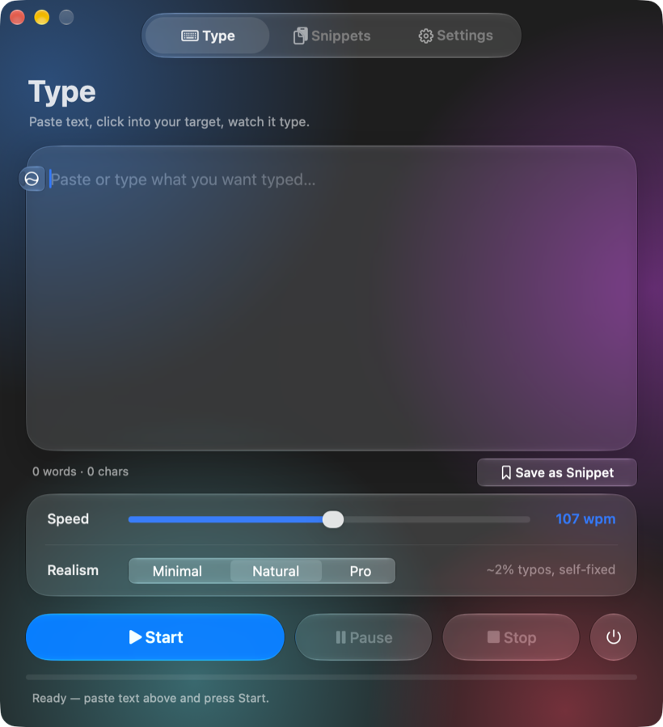
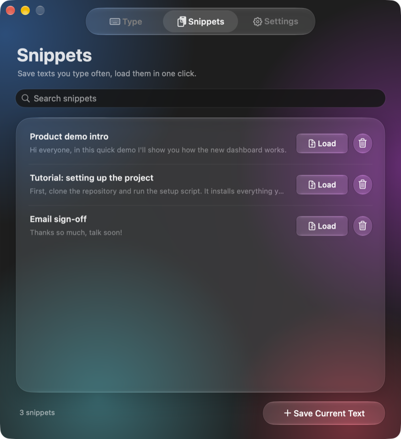
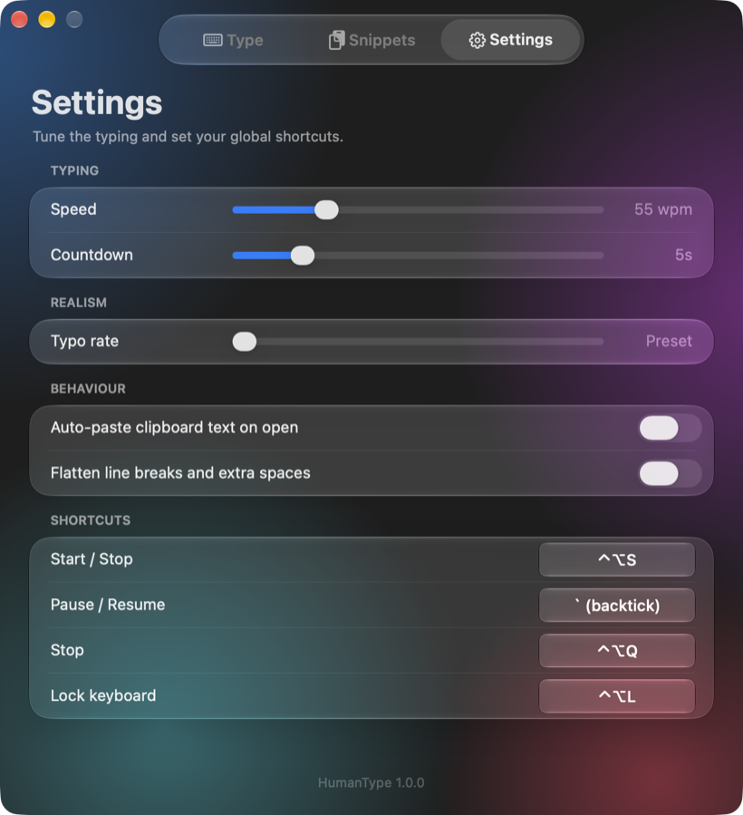
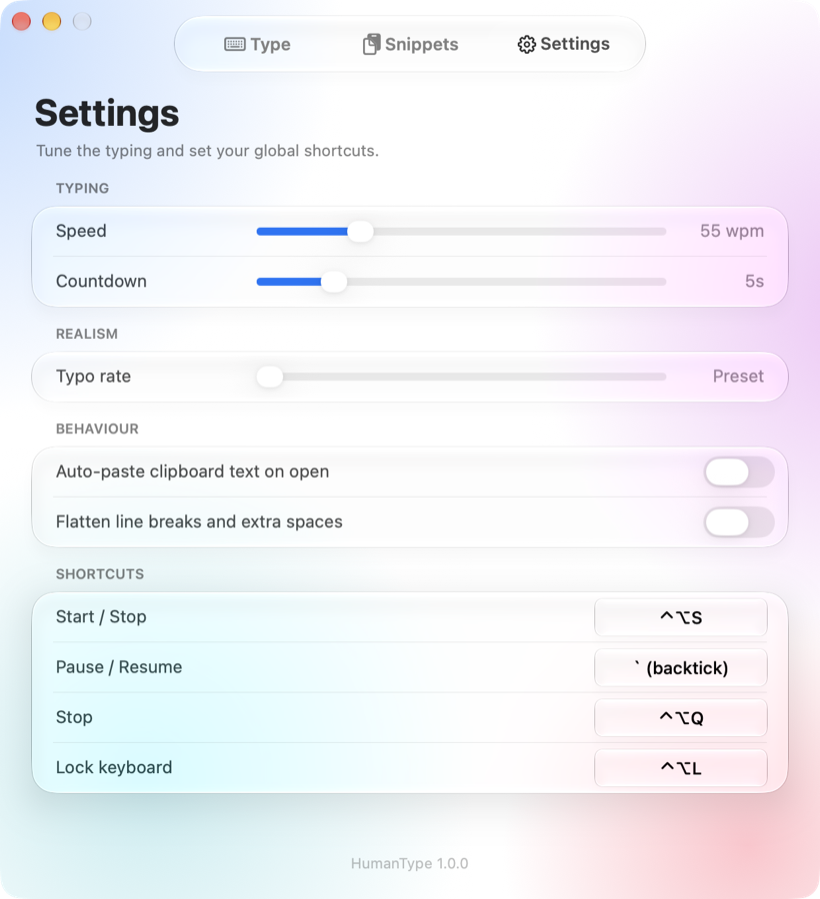
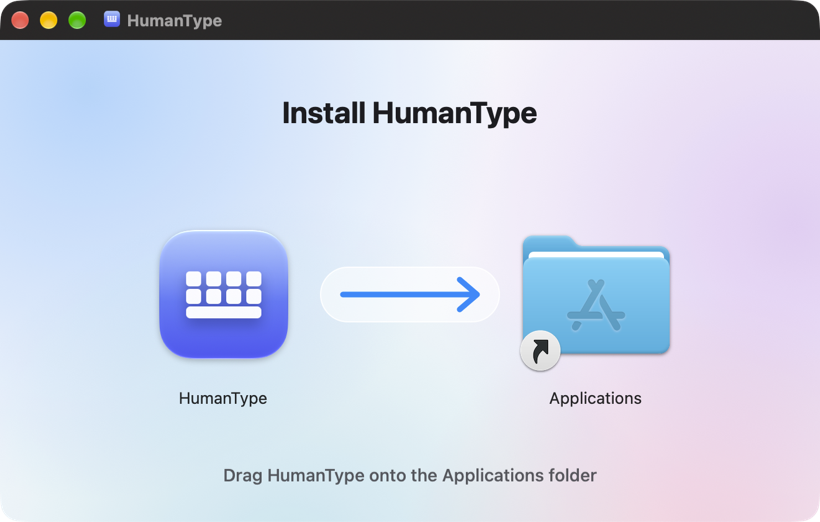

# HumanType

**Paste text, click into any app, and watch it get typed like a person is typing it.**

HumanType is a small macOS menu-bar app. It sends each character as its own
keystroke, with an uneven human rhythm: quick bursts inside words, pauses at
commas and periods, the odd hesitation, and occasional typos that it notices and
fixes. It works anywhere you can type: Google Docs, Notion, Word, Slack, a
code editor, a terminal. That makes it handy for screen recordings, product
demos, tutorials, and videos where the typing has to look real.

<p align="center">
  
</p>

<p align="center">
  
  
  
</p>

## Download

**[⬇ Download HumanType.dmg](https://github.com/sammystech/HumanType/releases/latest/download/HumanType.dmg)** · [all releases](https://github.com/sammystech/HumanType/releases)

Needs **macOS 26 (Tahoe) or later** on an **Apple Silicon** Mac (M1 or newer).

## Install

1. Open `HumanType.dmg` and drag **HumanType** onto the **Applications** folder.

   

2. Open HumanType from Applications. The first time, macOS says it
   *can't verify the developer*. That's expected for apps shared outside the
   App Store. Click **Done**, then go to **System Settings → Privacy & Security**,
   scroll down, and click **Open Anyway** next to HumanType. You only do this once.
3. HumanType lives in the menu bar (the ⌨ keyboard icon), not the Dock.
4. The first time you press **Start**, macOS asks you to allow **Accessibility**
   for HumanType, which it needs to type into other apps. Switch it on under
   **System Settings → Privacy & Security → Accessibility**, then press Start again.
   If it still isn't detected, use the menu-bar item **Quit & Reopen (apply permission)**.

## Use it

1. Paste (or type) your text into the box.
2. Pick a **speed** (10–200 wpm) and a **realism** level:
   **Minimal** (no typos), **Natural** (~2% typos), or **Pro** (~4%).
3. Press **Start**. The window gets out of the way, and you have a few seconds
   (5 by default) to click into the place you want it typed.
4. Watch it type. The progress bar and time-left estimate are on the Type tab.

Global shortcuts work from any app. You can change all of them under **Settings → Shortcuts**:

| Shortcut | What it does |
| --- | --- |
| `⌃⌥S` | Start typing (from any app), or stop if it's already typing |
| `` ` `` (backtick) | Pause / resume while typing. The key is swallowed, so it never lands in your document |
| `⌃⌥Q` | Emergency stop |
| `⌃⌥L` | Lock the physical keyboard, so a bumped key can't sneak into a take. The mouse still works, and HumanType's own keystrokes still go through |

**Snippets** saves texts you type often, so you can load them in one click.
**Settings** has the countdown length, a manual typo rate, auto-paste of the clipboard, and line-break flattening.

## Updates

HumanType updates itself. A few seconds after it opens (and every 6 hours
while it's running), it checks this repo's latest release. When there's a new
one, it offers **Download & Install**, swaps itself for the new version, and
reopens. You can also check any time from the menu bar with **Check for Updates**.
Your settings, snippets, and Accessibility permission carry over.

---

## For the maintainer

### Build

```bash
./build_humantype.sh
```

Builds `dist/HumanType.app` and the drag-to-install `dist/HumanType.dmg`,
self-tests the bundle, and installs it to `/Applications` (`INSTALL=0` skips
the install). The first run creates `.venv` and compiles PyInstaller's
bootloader from source (takes about a minute). The bootloader becomes the
app's executable, and macOS only gives an app the Liquid Glass design when
that executable links the macOS 26+ SDK. PyPI's prebuilt one links an older
SDK, which silently drops the whole app into the old look. The build refuses
to finish if that happens.

The app is signed with your Apple Development certificate if you have one.
Keep signing with the same certificate: the Accessibility permission is tied
to it, which is why it survives updates.

### Ship an update

```bash
./release.sh 1.2.0 "What changed, in a sentence or two"
```

That bumps the version, builds and self-tests, commits, tags `v1.2.0`,
pushes, and publishes a GitHub Release with the DMG attached. Everyone's
installed copy picks it up on its next check. Releases have to go up in
version, and are built from a clean `main`.

### Command line

The typing engine also runs on its own from a terminal (`pip install pynput pyobjc`):

```bash
python3 humantype.py --clipboard --wpm 60
```

### Layout

| File | What's in it |
| --- | --- |
| `humantype.py` | Typing engine: timing model, typos and corrections, keystroke posting, CLI |
| `humantype_ui.py` | The AppKit menu-bar app and its Liquid Glass UI, hotkeys, snippets, updater |
| `humantype_app.py` | Bundle entry point and self-tests |
| `HumanType.spec` | PyInstaller spec (reads the version from `APP_VERSION`) |
| `build_humantype.sh`, `release.sh` | Build + install, and publish a release |
| `dmg_settings.py`, `tools/make_dmg_background.py` | The installer window's layout and background |
